# Todo CLI - Security Documentation

## Table of Contents

1. [Security Overview](#security-overview)
2. [Threat Model](#threat-model)
3. [Security Features](#security-features)
4. [Known Limitations](#known-limitations)
5. [Best Practices](#best-practices)
6. [Vulnerability Reporting](#vulnerability-reporting)

---

## Security Overview

Todo CLI is designed with a **security-first mindset** for local, single-user task management. The application follows the principle of **least privilege** and maintains an **air-gapped architecture** with no network communication.

**Core Security Principles:**

- 🔒 **Local-First**: All data stays on the user's machine
- 🚫 **No Network**: Zero external communication
- ✅ **Input Validation**: All user inputs are validated and sanitized
- 🔐 **File Permissions**: Appropriate Unix permissions on data files (0644)
- 📦 **Minimal Dependencies**: Limited attack surface (4 direct dependencies)
- 🔍 **Transparency**: Open source for security audits

---

## Threat Model

### What We Protect Against

```mermaid
graph TB
    subgraph "Protected ✅"
        A[Path Traversal]
        B[Command Injection]
        C[SQL Injection]
        D[Network Attacks]
    end

    subgraph "Partial Protection ⚠️"
        E[Data at Rest]
        F[Physical Access]
        G[Memory Dumps]
    end

    subgraph "User Responsibility ❌"
        H[Malicious Binary]
        I[Compromised OS]
        J[Backup Security]
    end

    style A fill:#4caf50
    style B fill:#4caf50
    style C fill:#4caf50
    style D fill:#4caf50
    style E fill:#ff9800
    style F fill:#ff9800
    style G fill:#ff9800
    style H fill:#ef5350
    style I fill:#ef5350
    style J fill:#ef5350
```



| Threat Category       | Status       | Mitigation                               |
| --------------------- | ------------ | ---------------------------------------- |
| **Path Traversal**    | ✅ Protected | Input validation prevents `../` in paths |
| **Command Injection** | ✅ Protected | No shell command execution               |
| **SQL Injection**     | ✅ Protected | File-based storage, no SQL               |
| **Network Attacks**   | ✅ Protected | No network communication                 |
| **Data at Rest**      | ⚠️ Partial   | Use OS-level full-disk encryption        |
| **Physical Access**   | ⚠️ Partial   | Lock workstation, use strong passwords   |
| **Malicious Binary**  | ❌ User      | Verify checksums, build from source      |
| **Compromised OS**    | ❌ User      | Keep system updated, use antivirus       |

---

## Security Features

### 1. Air-Gapped Architecture

**Zero Network Communication** - The application never makes network calls, eliminating entire classes of vulnerabilities:

- ✅ No data exfiltration risk
- ✅ No remote code execution
- ✅ No dependency on external services
- ✅ Works completely offline

### 2. Input Validation

All user inputs are validated before processing:

| Input Type          | Validation Applied                                   |
| ------------------- | ---------------------------------------------------- |
| **Task Title**      | Max 200 chars, no control characters                 |
| **File Paths**      | Absolute paths only, no `../`, within home directory |
| **Dates**           | Validated format, reasonable range (2000-2100)       |
| **Priority/Status** | Enum whitelist validation                            |
| **Tags/Projects**   | Alphanumeric + symbols, length limits                |

**Example Validation:**

```go
func validateTitle(title string) error {
    if strings.TrimSpace(title) == "" {
        return errors.New("title cannot be empty")
    }
    if len(title) > 200 {
        return errors.New("title too long")
    }
    // Check for control characters
    for _, r := range title {
        if unicode.IsControl(r) && r != '\n' && r != '\t' {
            return errors.New("invalid characters")
        }
    }
    return nil
}
```

### 3. File System Security

**Secure Defaults:**

```bash
# Data directory permissions
~/.todo-cli/          # drwxr-xr-x (0755)
  tasks.json          # -rw-r--r-- (0644)
  backups/            # drwxr-xr-x (0755)
    backup_*.json     # -rw-r--r-- (0644)
```

**Path Sanitization:**

- All paths resolved to absolute
- Restricted to `~/.todo-cli/` directory
- No path traversal allowed
- Atomic file writes for data integrity

### 4. Minimal Dependencies

Only 4 direct dependencies from trusted sources:

- `spf13/cobra` - CLI framework (used by kubectl, Hugo)
- `fatih/color` - Terminal colors
- `manifoldco/promptui` - Interactive prompts
- `gopkg.in/yaml.v3` - YAML parser

All dependencies are version-pinned in `go.mod` with checksums in `go.sum`.

---

## Known Limitations

### Current Security Gaps

| Limitation                    | Impact | Mitigation                                                   |
| ----------------------------- | ------ | ------------------------------------------------------------ |
| **Unencrypted Data at Rest**  | Medium | Use OS full-disk encryption (FileVault/BitLocker/LUKS)       |
| **Terminal History Exposure** | Low    | Use `export HISTIGNORE="todo*"` or leading space in commands |
| **No Access Logging**         | Low    | Single-user design; use OS-level auditing if needed          |
| **Memory Dumps**              | Low    | Avoid running on untrusted/shared systems                    |
| **No Multi-User Support**     | N/A    | Designed for single-user use                                 |

**Recommended Mitigations:**

```bash
# Enable full-disk encryption
# macOS: sudo fdesetup enable
# Linux: Use LUKS during installation
# Windows: Enable BitLocker

# Prevent command history leakage
export HISTIGNORE="todo*"

# Restrict data directory access
chmod 700 ~/.todo-cli
```

---

## Best Practices

### For Users

**Data Security:**

```bash
# Restrict access to data directory
chmod 700 ~/.todo-cli

# Encrypt backups for external storage
tar czf - ~/.todo-cli/backups | \
    gpg -c > todo-backups-$(date +%Y%m%d).tar.gz.gpg
```

**Task Content:**

- ✅ Use code names for sensitive projects
- ✅ Be mindful when sharing screen
- ❌ Don't store passwords or API keys
- ❌ Avoid highly sensitive personal data without encryption

### For Developers

**Secure Coding Checklist:**

- [ ] All user inputs validated
- [ ] File paths sanitized
- [ ] No shell command execution
- [ ] Errors don't leak sensitive info
- [ ] Dependencies kept up to date
- [ ] Appropriate file permissions set

**Security Testing:**

```bash
# Static analysis
go vet ./...
staticcheck ./...

# Dependency vulnerabilities
go list -json -m all | nancy sleuth

# Build with security flags
go build -race -buildmode=pie
```

---

## Vulnerability Reporting

**If you discover a security vulnerability:**

1. **DO NOT** open a public GitHub issue
2. Email: gouranga.samrat@gmail.com
3. Include:
   - Description of vulnerability
   - Steps to reproduce
   - Potential impact
   - Suggested fix (if any)

**Response Timeline:**

- 24 hours: Initial acknowledgment
- 72 hours: Preliminary assessment
- 7 days: Detailed response with timeline
- 30 days: Fix released (critical issues)

We follow **responsible disclosure** - vulnerabilities are fixed privately before public disclosure.

---

## Summary

**Todo CLI Security Strengths:**

- ✅ Air-gapped (no network)
- ✅ Input validation throughout
- ✅ Minimal dependencies
- ✅ Secure file permissions
- ✅ Open source & auditable

**User Responsibilities:**

- Enable OS-level encryption
- Secure backup storage
- Keep dependencies updated
- Follow security best practices

**Remember:** Security is a shared responsibility between the application and its users.

---

**Last Updated:** 2024-03-12
**Security Contact:** gouranga.samrat@com
